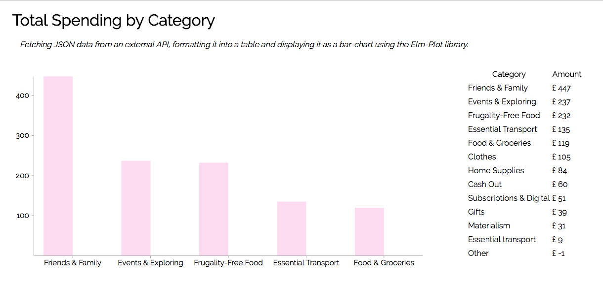

# Elm Dashboard
#### A simple dashboard, written in Elm, to track expenditures

[Elm](http://elm-lang.org/) is a programming language which compiles to HTML and JavaScript. Elm's advantages include an intuitive functional reactive programming style, a no-runtime-error guarantee, and a time-travelling debugger.

This dashboard:
* Fetches data asynchronously through the Elm HTTP commands;
* Decodes this data from a JSON string into Elm native data-types;
* Formats the data into a table; and
* Displays a subset of this data in a bar chart.

One external library, [elm-plot](https://github.com/terezka/elm-plot) is used to display the bar chart.

The data shown is retrieved from a spending tracker API hosted on Amazon Web Services. This spending tracker returns a nested, sorted JSON structure containing total amounts of money spent for each category.
